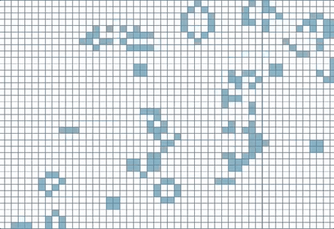

# Game of Life [](https://travis-ci.org/lloydmeta/gol-rs)

Conway's Game of Life implemented in Rust and OpenGL via [`gfx-rs`](https://github.com/gfx-rs).

Done as an exercise to practise Rust and get my feet with with OpenGL.

Areas explored:
  * General rendering
  * Vertex, fragment shaders
  * [Pipeline state objects](https://gfx-rs.github.io/2016/01/22/pso.html)
  * [Rayon](https://github.com/nikomatsakis/rayon) for parallel processing



## Usage

You can install the executable via `cargo install gol`, then run via `gol`, or if you've cloned the
repo,`cargo run`.

```bash
OPTIONS:
    -h, --grid-height <grid-height>        Height of the grid [default: 80]
    -w, --grid-width <grid-width>          Width of the grid [default: 100]
    -u, --update-rate <update-rate>        Number of updates to the game board per second [default: 30]
        --window-height <window-height>    Height of the window [default: 768]
        --window-width <window-width>      Width of the window [default: 1024]
```

If running via `cargo`, options need to be passed by appending `--`, i.e. `cargo run -- -h 10 -w 10`.

## Todo

  * Optimise!